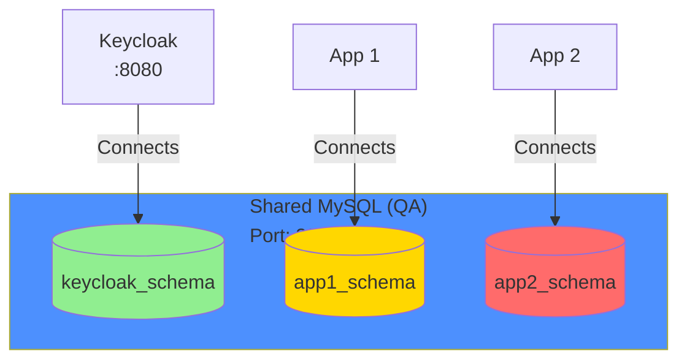
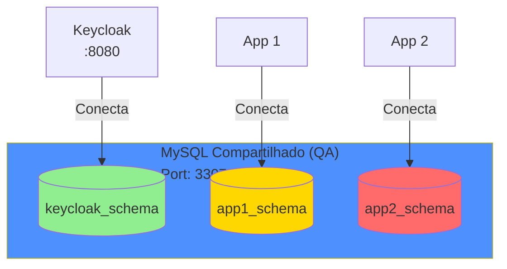

# QA Environment - Shared Database

**English | [Português](#ambiente-qa---banco-compartilhado)**

---

## Overview

The QA environment demonstrates a scenario where **a single MySQL database is shared** between Keycloak and other applications, each using its own schema/database.

## Architecture



## How to Run

### 1. Start the QA environment

```bash
docker-compose -f docker-compose.qa.yml up -d
```

### 2. Access services

- **Keycloak Admin**: http://localhost:8080
- **MailHog Web**: http://localhost:8026
- **MySQL (external port)**: localhost:3307

### 3. Connect other apps to the shared database

Other applications can connect to the database using:

```yaml
# Example: docker-compose for another app
version: '3.8'

services:
  my-app:
    image: my-app:latest
    environment:
      DB_HOST: mysql-shared-qa
      DB_PORT: 3306
      DB_NAME: app1_schema
      DB_USER: appuser
      DB_PASSWORD: appuser123
    networks:
      - qa-network

networks:
  qa-network:
    external: true
```

## Created Schemas

The initialization script automatically creates:
- `keycloak_schema` - used by Keycloak
- `app1_schema` - available for App 1
- `app2_schema` - available for App 2

## Credentials (default)

```
MySQL Root: root123
MySQL User: appuser
MySQL Password: appuser123

Keycloak Admin: admin
Keycloak Password: admin123
```

**⚠️ Warning**: In a real environment, each app should have its own isolated database. This setup is for learning demonstration only.

## Stop the environment

```bash
docker-compose -f docker-compose.qa.yml down
```

## Remove everything (including data)

```bash
docker-compose -f docker-compose.qa.yml down -v
```

---

# Ambiente QA - Banco Compartilhado

**[English](#qa-environment---shared-database) | Português**

---

## Visão Geral

O ambiente QA demonstra um cenário onde **um único banco MySQL é compartilhado** entre o Keycloak e outros aplicativos, cada um usando seu próprio schema/database.

## Arquitetura



## Como Executar

### 1. Subir o ambiente QA

```bash
docker-compose -f docker-compose.qa.yml up -d
```

### 2. Acessar os serviços

- **Keycloak Admin**: http://localhost:8080
- **MailHog Web**: http://localhost:8026
- **MySQL (porta externa)**: localhost:3307

### 3. Conectar outros apps ao banco compartilhado

Outros aplicativos podem se conectar ao banco usando:

```yaml
# Exemplo: docker-compose para outro app
version: '3.8'

services:
  my-app:
    image: meu-app:latest
    environment:
      DB_HOST: mysql-shared-qa
      DB_PORT: 3306
      DB_NAME: app1_schema
      DB_USER: appuser
      DB_PASSWORD: appuser123
    networks:
      - qa-network

networks:
  qa-network:
    external: true
```

## Schemas Criados

O script de inicialização cria automaticamente:
- `keycloak_schema` - usado pelo Keycloak
- `app1_schema` - disponível para App 1
- `app2_schema` - disponível para App 2

## Credenciais (padrão)

```
MySQL Root: root123
MySQL User: appuser
MySQL Password: appuser123

Keycloak Admin: admin
Keycloak Password: admin123
```

**⚠️ Atenção**: Em um ambiente real, cada app deveria ter seu próprio banco isolado. Este setup é apenas para demonstração de aprendizado.

## Parar o ambiente

```bash
docker-compose -f docker-compose.qa.yml down
```

## Remover tudo (incluindo dados)

```bash
docker-compose -f docker-compose.qa.yml down -v
```
