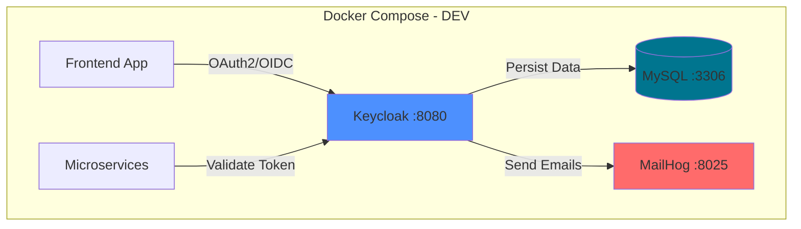
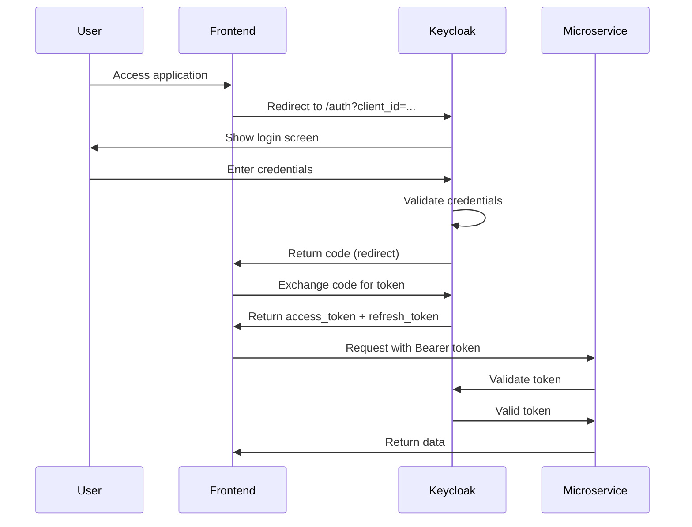
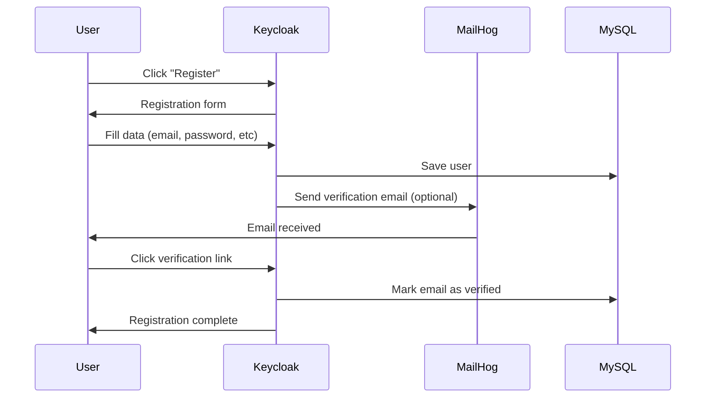
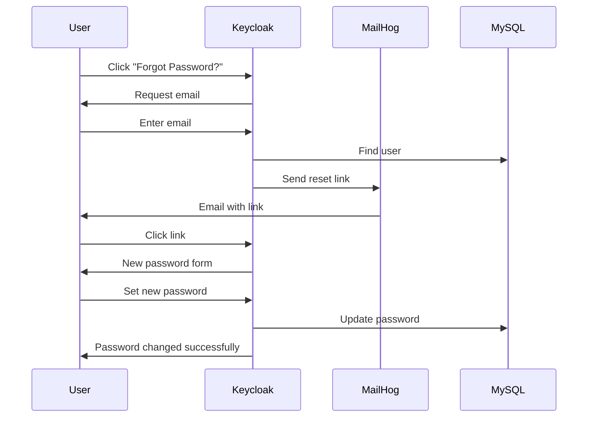
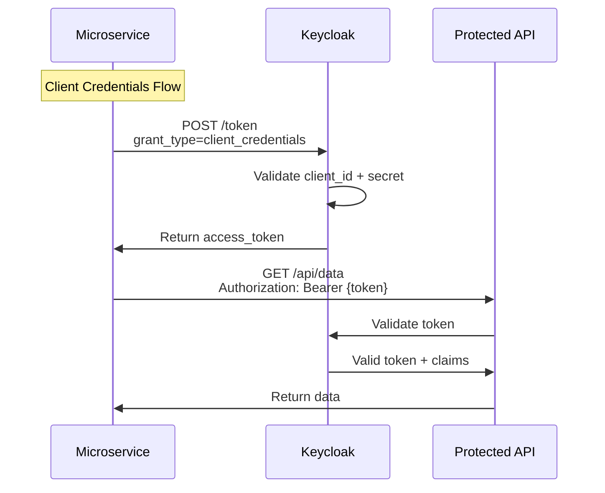
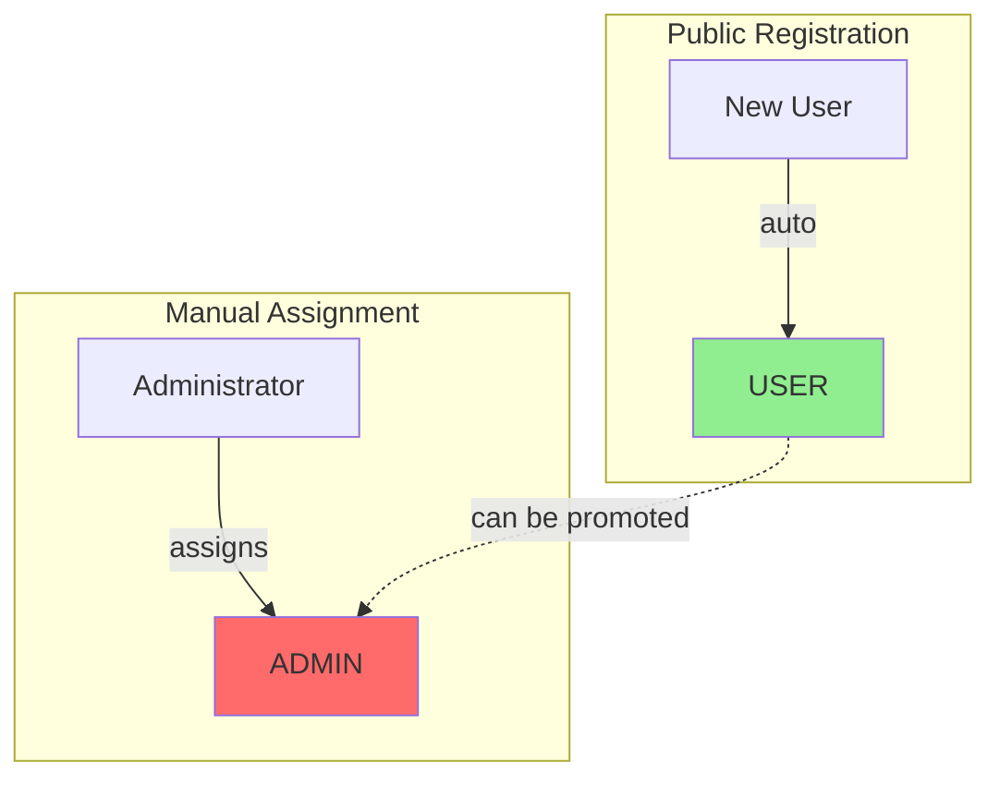

# Keycloak Infrastructure

**English | [Português](README.pt-BR.md)**

---

This project was developed as part of my career study for DEV and SDET (Software Development Engineer in Test) roles. The goal is to demonstrate expertise in modern authentication architecture, test automation, systems integration, and infrastructure best practices.

All technical decisions, integrations, role flows, automations, and project organization reflect my practical experience and professional vision for robust development and testing environments.

Key skills demonstrated:

- IAM architecture with Keycloak
- Authentication and email test automation (MailHog)
- Reproducible provisioning with Docker Compose
- Secure access control and role separation
- Automation examples via API and Node.js
- Detailed and didactic documentation

> **Note:** I used GitHub Copilot to speed up boilerplate and annotation creation, but all architecture, Keycloak integration, test strategy, and project organization decisions were my own.

## 📋 Table of Contents

- [Overview](#overview)
- [Architecture](#architecture)
- [Environments](#environments)
- [Components](#components)
- [Authentication Flows](#authentication-flows)
- [Configuration](#configuration)
- [Endpoints and URLs](#endpoints-and-urls)
- [Usage Guide](#usage-guide)
- [Additional Documentation](#additional-documentation)

---

## 🎯 Overview

This project sets up a complete Identity and Access Management (IAM) environment using:

- **Keycloak 21.1.1**: Authentication and authorization server
- **MySQL 8.0**: Database for persistence (local or cloud)
- **MailHog**: Fake SMTP server for email testing

**Supports 3 environments**: DEV, QA, and PROD with different configurations.

---

## 🏗️ Architecture

### Development Environment



See [QA-README.md](QA-README.md) for QA environment architecture.

---

## 🌍 Environments

### DEV (Development)

- **File**: `docker-compose.yml`
- **Database**: Local MySQL container
- **Ports**: Keycloak (8080), MySQL (3306), MailHog (8025)
- **Use**: Local development and testing

### QA (Quality Assurance)

- **File**: `docker-compose.qa.yml`
- **Database**: Shared MySQL container (demo of shared DB)
- **Ports**: Keycloak (8080), MySQL (3307), MailHog (8026)
- **Use**: Testing with multiple apps sharing one database
- **Details**: See [QA-README.md](QA-README.md)

### PROD (Production)

- **File**: `docker-compose.prod.yml`
- **Database**: External (AWS RDS, Cloud SQL, etc.)
- **Ports**: Keycloak (8080)
- **Use**: Production deployment
- **Config**: Requires `.env.prod` with cloud database credentials

---

## 🧩 Components

### Keycloak

- **Port**: 8080 (all environments)
- **Admin**: admin / admin
- **Protocols**: OAuth2, OpenID Connect, SAML
- **Features**:
  - Single Sign-On (SSO)
  - Identity Brokering
  - User Federation
  - Social Login
  - Multi-factor Authentication (MFA)

### MySQL

- **Port**: 3306
- **Database**: keycloak
- **User**: keycloak / keycloak
- **Root Password**: rootpassword

### MailHog

- **SMTP**: localhost:1025
- **Web UI**: http://localhost:8025
- Captures all emails sent by Keycloak

---

## 🔐 Authentication Flows

### 1. Login Flow (Authorization Code Flow)



### 2. User Registration Flow



### 3. Password Recovery Flow



### 4. Token Flow for Microservices



---

## ⚙️ Configuration

### Available Environments

This project supports three environments with different configurations:

| Environment | File                      | Database                 | Ports                             | Use Case               |
| ----------- | ------------------------- | ------------------------ | --------------------------------- | ---------------------- |
| **DEV**     | `docker-compose.yml`      | Local MySQL (container)  | KC: 8080, MySQL: 3306, Mail: 8025 | Local development      |
| **QA**      | `docker-compose.qa.yml`   | Shared MySQL (demo)      | KC: 8080, MySQL: 3307, Mail: 8026 | Testing with shared DB |
| **PROD**    | `docker-compose.prod.yml` | External (AWS RDS/Cloud) | KC: 8080                          | Production deployment  |

### Start the Environment

**Development (DEV)**

```bash
docker-compose up -d
```

**Quality Assurance (QA)**

```bash
docker-compose -f docker-compose.qa.yml up -d
```

**Production (PROD)**

```bash
# Configure .env.prod first
docker-compose -f docker-compose.yml -f docker-compose.prod.yml --env-file .env.prod up -d
```

### Access Interfaces

**Development:**

- **Keycloak Admin**: http://localhost:8080
- **MailHog Web**: http://localhost:8025

**QA:**

- **Keycloak Admin**: http://localhost:8080
- **MailHog Web**: http://localhost:8026

### Automatic Realm Import

For automatic realm import, place your JSON files in the `config-realm/` folder and restart Keycloak.

See [REALM-IMPORT.md](REALM-IMPORT.md) for more details.

### Create Realm Manually (Optional)

1. Access Admin Console (admin/admin)
2. Top menu: **Master** → **Create Realm**
3. Name: `myrealm`
4. Click **Create**

### Configure Client for Frontend (Public)

1. **Clients** → **Create client**
2. Configuration:
   ```yaml
   Client ID: frontend-app
   Client type: OpenID Connect
   Client authentication: OFF (public)
   Authentication flow: ✓ Standard flow, ✓ Direct access grants
   Valid redirect URIs: http://localhost:3000/*
   Web origins: +
   ```

### Configure Client for Microservices (Confidential)

1. **Clients** → **Create client**
2. Configuration:
   ```yaml
   Client ID: microservices-client
   Client type: OpenID Connect
   Client authentication: ON (confidential)
   Authentication flow: ✓ Service accounts roles, ✓ Direct access grants
   ```
3. **Credentials** tab: copy the **Client Secret**

### Configure Roles (Permissions)

1. **Create Realm Roles**:
   - Menu: **Realm roles** → **Create role**
   - Create the following roles:
     - `USER` - Default role for regular users
     - `ADMIN` - Manually assigned to administrators

2. **Set Default Role for Public Registration**:
   - **Realm settings** → **Default roles**
   - Click **Assign role**
   - Select `USER`
   - Click **Assign**
   - Now every user who registers publicly will automatically receive the `USER` role

3. **Manually Assign Roles** (ADMIN):
   - **Users** → select the user
   - **Role mapping** tab → **Assign role**
   - Select `ADMIN`
   - Click **Assign**

### Enable Realm Features

**Realm settings** → **Login**:

- ✅ User registration
- ✅ Forgot password
- ✅ Remember me
- ✅ Verify email (optional)

### Configure Email (MailHog)

**Realm settings** → **Email**:

```yaml
Host: mailhog
Port: 1025
From: noreply@keycloak.local
Enable SSL: OFF
Enable StartTLS: OFF
Enable Authentication: OFF
```

Click **Test connection** to validate.

---

## 🌐 Endpoints e URLs

### Endpoints OpenID Connect

Base URL: `http://localhost:8080/realms/{realm-name}/protocol/openid-connect`

| Endpoint                           | Method   | Description                |
| ---------------------------------- | -------- | -------------------------- |
| `/auth`                            | GET      | Start authentication       |
| `/token`                           | POST     | Obtain/renew tokens        |
| `/userinfo`                        | GET      | User information           |
| `/logout`                          | GET/POST | End session                |
| `/certs`                           | GET      | Public certificates (JWKS) |
| `.well-known/openid-configuration` | GET      | Provider configuration     |

### URLs for Frontend

#### Login

```
http://localhost:8080/realms/myrealm/protocol/openid-connect/auth?client_id=frontend-app&redirect_uri=http://localhost:3000/callback&response_type=code&scope=openid profile email
```

#### Registration

```
http://localhost:8080/realms/myrealm/protocol/openid-connect/registrations?client_id=frontend-app&redirect_uri=http://localhost:3000/callback&response_type=code&scope=openid
```

#### Logout

```
http://localhost:8080/realms/myrealm/protocol/openid-connect/logout?redirect_uri=http://localhost:3000
```

#### Logout Without Confirmation

```
http://localhost:8080/realms/myrealm/protocol/openid-connect/logout?post_logout_redirect_uri=http://localhost:3000&client_id=frontend-app
```

💡 **Tip**: Use `post_logout_redirect_uri` instead of `redirect_uri` to skip the logout confirmation screen.

#### Account Management

```
http://localhost:8080/realms/myrealm/account
```

---

## 📖 Usage Guide

### 1. Create User Manually

1. **Users** → **Add user**
2. Fill in:
   - Username: `testuser`
   - Email: `test@example.com`
   - Email verified: ON
3. **Create**
4. **Credentials** tab → **Set password**:
   - Password: `password123`
   - Temporary: OFF

### 2. Obtain Token via API

#### Token com Client Credentials (service-to-service)

```bash
curl -X POST http://localhost:8080/realms/myrealm/protocol/openid-connect/token \
  -H "Content-Type: application/x-www-form-urlencoded" \
  -d "grant_type=client_credentials" \
  -d "client_id=microservices-client" \
  -d "client_secret=SEU_CLIENT_SECRET"
```

#### Token com Password Grant (usuário)

```bash
curl -X POST http://localhost:8080/realms/myrealm/protocol/openid-connect/token \
  -H "Content-Type: application/x-www-form-urlencoded" \
  -d "grant_type=password" \
  -d "client_id=microservices-client" \
  -d "client_secret=SEU_CLIENT_SECRET" \
  -d "username=testuser" \
  -d "password=password123"
```

#### Refresh Token

```bash
curl -X POST http://localhost:8080/realms/myrealm/protocol/openid-connect/token \
  -H "Content-Type: application/x-www-form-urlencoded" \
  -d "grant_type=refresh_token" \
  -d "client_id=frontend-app" \
  -d "refresh_token=SEU_REFRESH_TOKEN"
```

### 4. Validate Roles in Backend

```javascript
// Example: check user role
const token = jwt.decode(accessToken);
const roles = token.realm_access?.roles || [];

if (roles.includes("ADMIN")) {
  // Full administrative access
} else if (roles.includes("USER")) {
  // Regular user access
} else {
  // No permission
}
```

**Token Example with Roles**:

```json
{
  "sub": "user-id",
  "realm_access": {
    "roles": ["USER", "offline_access"]
  },
  "preferred_username": "user@example.com"
}
```

### 5. Validate JWT Token

#### Backend Validation (Local Verification)

```javascript
// Node.js example
const jwt = require("jsonwebtoken");
const jwksClient = require("jwks-rsa");

const client = jwksClient({
  jwksUri: "http://localhost:8080/realms/myrealm/protocol/openid-connect/certs",
});

function getKey(header, callback) {
  client.getSigningKey(header.kid, (err, key) => {
    const signingKey = key.publicKey || key.rsaPublicKey;
    callback(null, signingKey);
  });
}

jwt.verify(token, getKey, { algorithms: ["RS256"] }, (err, decoded) => {
  if (err) {
    console.error("Invalid token:", err);
  } else {
    console.log("Valid token:", decoded);
  }
});
```

#### Via Endpoint de Introspection

```bash
curl -X POST http://localhost:8080/realms/myrealm/protocol/openid-connect/token/introspect \
  -H "Content-Type: application/x-www-form-urlencoded" \
  -d "client_id=microservices-client" \
  -d "client_secret=SEU_CLIENT_SECRET" \
  -d "token=SEU_ACCESS_TOKEN"
```

### 3. Implement Logout Without Confirmation

#### JavaScript/Frontend

```javascript
function logout() {
  const keycloakUrl = "http://localhost:8080";
  const realm = "myrealm";
  const redirectUri = encodeURIComponent("http://localhost:3000");
  const clientId = "frontend-app";

  window.location.href = `${keycloakUrl}/realms/${realm}/protocol/openid-connect/logout?post_logout_redirect_uri=${redirectUri}&client_id=${clientId}`;
}
```

#### Via API (Node.js)

```javascript
const axios = require("axios");

async function logoutUser(refreshToken) {
  try {
    await axios.post(
      "http://localhost:8080/realms/myrealm/protocol/openid-connect/logout",
      new URLSearchParams({
        client_id: "frontend-app",
        refresh_token: refreshToken,
      }),
      {
        headers: {
          "Content-Type": "application/x-www-form-urlencoded",
        },
      },
    );
    console.log("✅ Logout successful");
  } catch (error) {
    console.error("❌ Logout error:", error.response?.data);
  }
}
```

### 4. Test Password Recovery Flow

1. Access the login screen
2. Click **Forgot Password?**
3. Enter the user's email
4. Access http://localhost:8025 (MailHog)
5. See the email with the reset link
6. Click the link and set new password

---

## 🔧 Useful Commands

### Manage Containers

```bash
# Start
docker-compose up -d

# View logs
docker-compose logs -f keycloak

# Stop
docker-compose stop

# Remove everything (WARNING: deletes data)
docker-compose down -v

# Restart only Keycloak
docker-compose restart keycloak
```

### Database Backup

```bash
docker exec mysql-keycloak mysqldump -u keycloak -pkeycloak keycloak > backup.sql
```

### Restore Database

```bash
docker exec -i mysql-keycloak mysql -u keycloak -pkeycloak keycloak < backup.sql
```

---

## 🔐 Concepts and Techniques

### OAuth 2.0 Grant Types

| Grant Type             | Usage                          | Client Type         |
| ---------------------- | ------------------------------ | ------------------- |
| **Authorization Code** | Frontend SPAs, web apps        | Public/Confidential |
| **Client Credentials** | Service-to-service             | Confidential        |
| **Password Grant**     | Trusted apps (not recommended) | Confidential        |
| **Refresh Token**      | Renew expired tokens           | All                 |

### OpenID Connect (OIDC)

OAuth 2.0 extension for authentication:

- **ID Token**: JWT with user information
- **UserInfo Endpoint**: Additional profile data
- **Scopes**: `openid`, `profile`, `email`, `address`, `phone`

### JWT (JSON Web Token)

Estrutura: `header.payload.signature`

```json
// Header
{
  "alg": "RS256",
  "typ": "JWT",
  "kid": "key-id"
}

// Payload
{
  "sub": "user-id",
  "iss": "http://localhost:8080/realms/myrealm",
  "aud": "frontend-app",
  "exp": 1234567890,
  "iat": 1234567800,
  "email": "user@example.com",
  "preferred_username": "testuser",
  "realm_access": {
    "roles": ["user", "admin"]
  }
}
```

### Roles e Permissions

**Roles Hierarchy**:



**Configuration**:

1. Create roles: `USER`, `ADMIN` in **Realm roles**
2. Set `USER` as **Default role** in **Realm settings**
3. Manually assign `ADMIN` to specific users

---

## 📚 Additional Documentation

- [QA-README.md](QA-README.md) - QA environment with shared database
- [REALM-IMPORT.md](REALM-IMPORT.md) - How to import/export realm configurations
- [.env.prod.example](.env.prod.example) - Production environment variables
- [.env.qa.example](.env.qa.example) - QA environment variables

---

## 📚 References

- [Keycloak Documentation](https://www.keycloak.org/documentation)
- [OAuth 2.0 RFC](https://datatracker.ietf.org/doc/html/rfc6749)
- [OpenID Connect Spec](https://openid.net/connect/)
- [JWT.io](https://jwt.io)

---

## 🐛 Troubleshooting

### Error: "Invalid redirect_uri"

- Check if the URL is in **Valid redirect URIs** of the client

### Emails not arriving

- Check http://localhost:8025 (DEV) or http://localhost:8026 (QA/PROD)
- Confirm SMTP configuration in Realm settings → Email

### Token expired

- Use refresh_token to renew
- Configure lifetime in Realm settings → Tokens

### Database connection error

- Check if MySQL is running: `docker-compose ps`
- View logs: `docker-compose logs mysql`

---

## 📝 License

This project is for educational and development purposes.

---

## 👨‍💻 Sobre o Autor

Sou profissional focado em desenvolvimento de software e qualidade (DEV/SDET), com experiência em arquitetura de autenticação, automação de testes, integração de sistemas e infraestrutura moderna. Este projeto reflete minha busca constante por excelência técnica, aprendizado contínuo e aplicação de boas práticas em ambientes reais.

Utilizei o GitHub Copilot para acelerar a criação de trechos de boilerplate e anotações, porém toda a arquitetura da aplicação, a integração com o Keycloak, a estratégia de testes e a organização do projeto foram decisões técnicas minhas.

- [LinkedIn](https://www.linkedin.com/in/seu-usuario)
- [Portfólio](https://seu-portfolio.com)
- [Outros projetos no GitHub](https://github.com/jsnpereira)

---

## 👨‍💻 About the Author

I am a professional focused on software development and quality (DEV/SDET), with experience in authentication architecture, test automation, systems integration, and modern infrastructure. This project reflects my ongoing pursuit of technical excellence, continuous learning, and the application of best practices in real-world environments.

I used GitHub Copilot to speed up the creation of boilerplate and annotations, but all application architecture, Keycloak integration, test strategy, and project organization decisions were my own.

- [LinkedIn](https://www.linkedin.com/in/jeison-pereira)
- [Portfolio](https://seu-portfolio.com)
- [Other projects on GitHub](https://github.com/jsnpereira)
