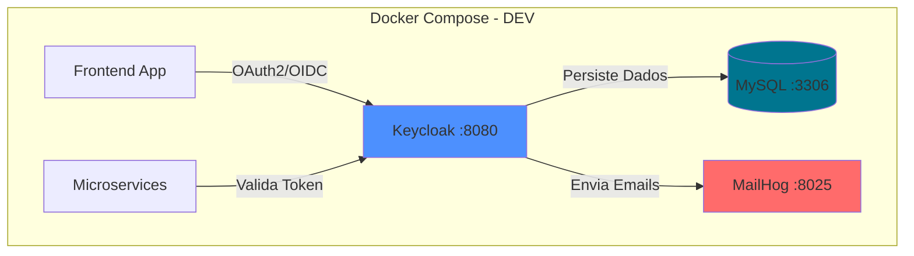
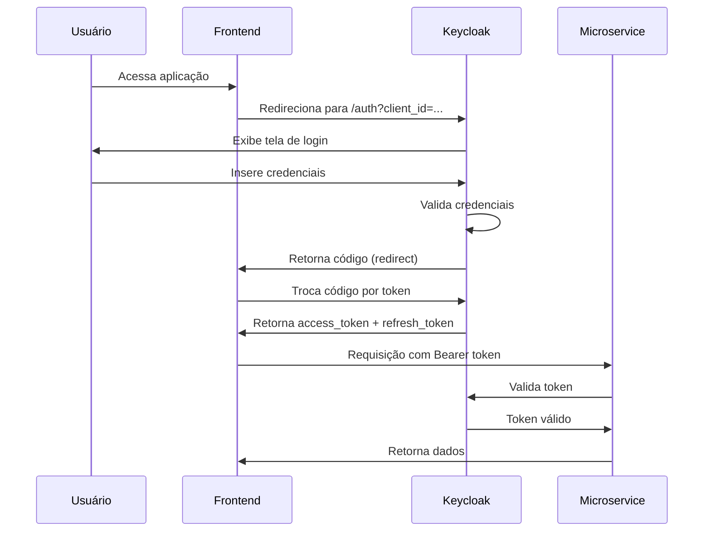
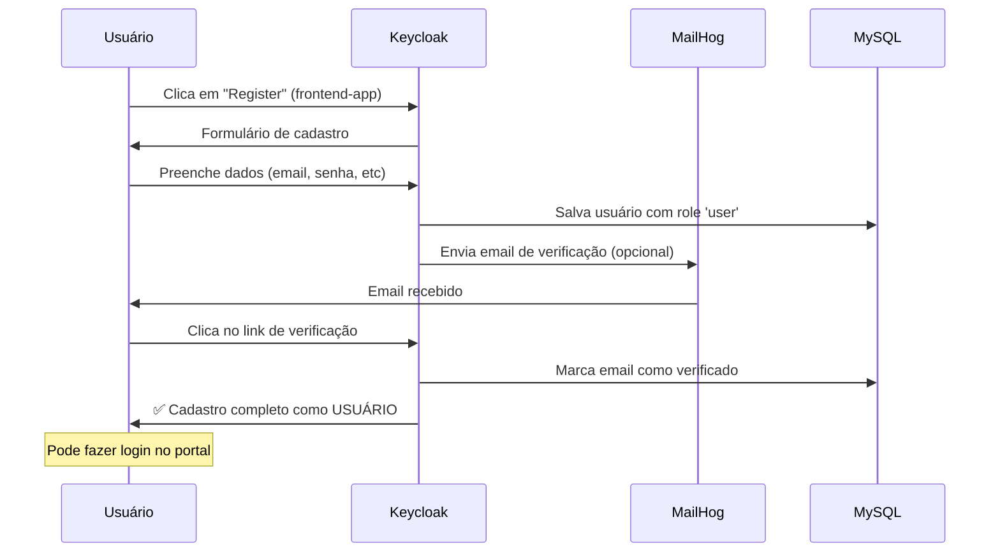
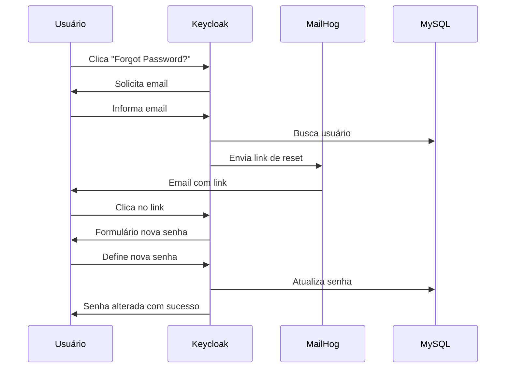
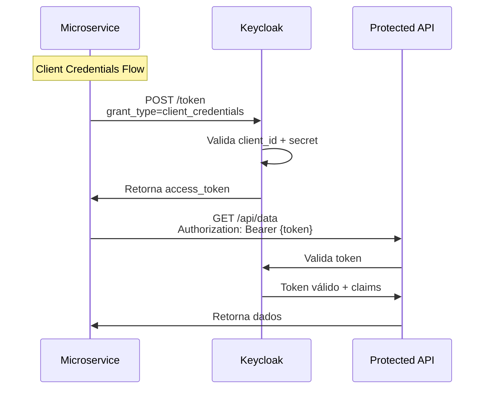
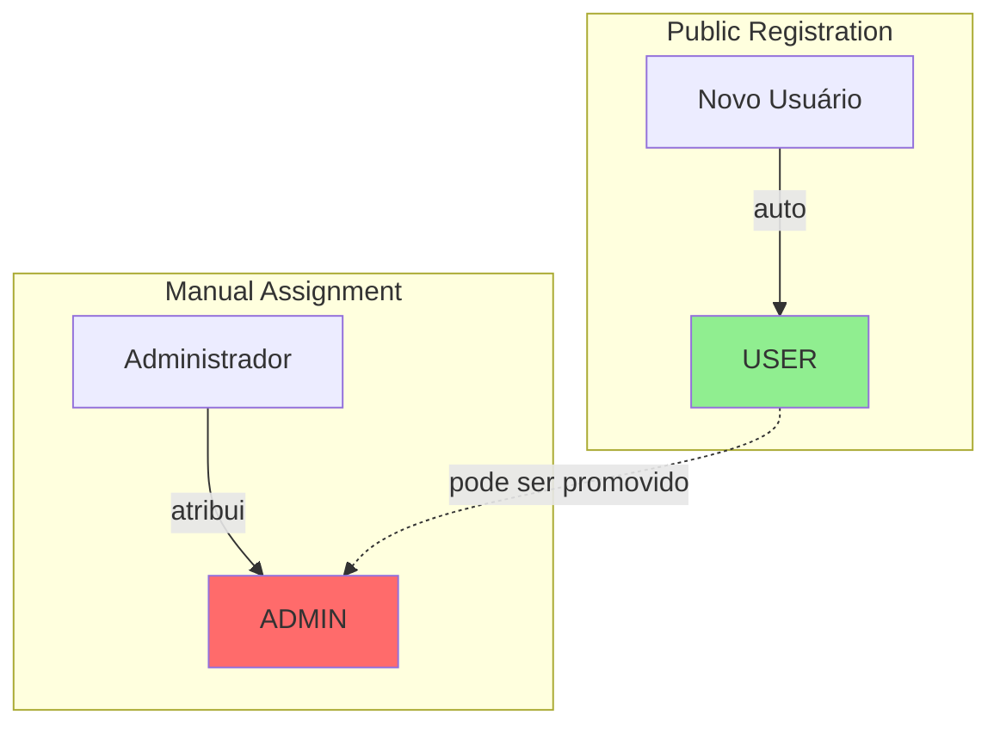

# Keycloak Infrastructure

**[English](README.md) | Português**

---

Este projeto foi desenvolvido como parte do meu estudo de carreira para atuação como DEV e SDET (Software Development Engineer in Test). O objetivo é demonstrar domínio em arquitetura de autenticação moderna, automação de testes, integração de sistemas e boas práticas de infraestrutura.

Todas as decisões técnicas, integrações, fluxos de roles, automações e organização do projeto refletem minha experiência prática e visão profissional para ambientes de desenvolvimento e testes robustos.

Principais competências demonstradas:

- Arquitetura IAM com Keycloak
- Automação de testes de autenticação e email (MailHog)
- Provisionamento reprodutível com Docker Compose
- Separação de roles e controle de acesso seguro
- Exemplos de automação via API e Node.js
- Documentação detalhada e didática

> **Nota:** Utilizei o GitHub Copilot para acelerar a criação de boilerplate e anotações, porém toda a arquitetura, integração com o Keycloak, estratégia de testes e organização dos projetos do aplicação foram decisões técnicas minhas.

## 📋 Índice

- [Visão Geral](#visão-geral)
- [Arquitetura](#arquitetura)
- [Ambientes](#ambientes)
- [Componentes](#componentes)
- [Fluxos de Autenticação](#fluxos-de-autenticação)
- [Configuração](#configuração)
- [Endpoints e URLs](#endpoints-e-urls)
- [Guia de Uso](#guia-de-uso)
- [Documentação Adicional](#documentação-adicional)

---

## 🎯 Visão Geral

Este projeto configura um ambiente completo de Identity and Access Management (IAM) usando:

- **Keycloak 21.1.1**: Servidor de autenticação e autorização
- **MySQL 8.0**: Banco de dados para persistência (local ou nuvem)
- **MailHog**: Servidor SMTP fake para testes de email

**Suporta 3 ambientes**: DEV, QA e PROD com diferentes configurações.

---

## 🏗️ Arquitetura

### Ambiente de Desenvolvimento



Veja [QA-README.md](QA-README.md) para a arquitetura do ambiente QA.

---

## 🌍 Ambientes

### DEV (Desenvolvimento)

- **Arquivo**: `docker-compose.yml`
- **Banco de Dados**: MySQL local (container)
- **Portas**: Keycloak (8080), MySQL (3306), MailHog (8025)
- **Uso**: Desenvolvimento e testes locais

### QA (Quality Assurance)

- **Arquivo**: `docker-compose.qa.yml`
- **Banco de Dados**: MySQL compartilhado (demo de BD compartilhado)
- **Portas**: Keycloak (8080), MySQL (3307), MailHog (8026)
- **Uso**: Testes com múltiplas apps compartilhando um banco
- **Detalhes**: Veja [QA-README.md](QA-README.md)

### PROD (Produção)

- **Arquivo**: `docker-compose.prod.yml`
- **Banco de Dados**: Externo (AWS RDS, Cloud SQL, etc.)
- **Portas**: Keycloak (8080)
- **Uso**: Deploy em produção
- **Config**: Requer `.env.prod` com credenciais do banco na nuvem

---

## 🧩 Componentes

### Keycloak

- **Porta**: 8080 (todos os ambientes)
- **Admin**: admin / admin
- **Protocolos**: OAuth2, OpenID Connect, SAML
- **Funcionalidades**:
  - Single Sign-On (SSO)
  - Identity Brokering
  - User Federation
  - Social Login
  - Multi-factor Authentication (MFA)

### MySQL

- **Porta**: 3306
- **Database**: keycloak
- **User**: keycloak / keycloak
- **Root Password**: rootpassword

### MailHog

- **SMTP**: localhost:1025
- **Web UI**: http://localhost:8025
- Captura todos os emails enviados pelo Keycloak

---

## 🔐 Fluxos de Autenticação

### 1. Fluxo de Login (Authorization Code Flow)



### 2. Fluxo de Cadastro (User Registration)

#### Cadastro de Usuário (Auto-cadastro)



### 3. Fluxo de Recuperação de Senha



### 4. Fluxo de Token para Microserviços



---

## ⚙️ Configuração

### Ambientes Disponíveis

Este projeto suporta três ambientes com diferentes configurações:

| Ambiente | Arquivo                   | Banco de Dados             | Portas                            | Uso                         |
| -------- | ------------------------- | -------------------------- | --------------------------------- | --------------------------- |
| **DEV**  | `docker-compose.yml`      | MySQL local (container)    | KC: 8080, MySQL: 3306, Mail: 8025 | Desenvolvimento local       |
| **QA**   | `docker-compose.qa.yml`   | MySQL compartilhado (demo) | KC: 8080, MySQL: 3307, Mail: 8026 | Testes com BD compartilhado |
| **PROD** | `docker-compose.prod.yml` | Externo (AWS RDS/Cloud)    | KC: 8080                          | Deploy em produção          |

### Iniciar o Ambiente

**Desenvolvimento (DEV)**

```bash
docker-compose up -d
```

**Quality Assurance (QA)**

```bash
docker-compose -f docker-compose.qa.yml up -d
```

**Produção (PROD)**

```bash
# Configure o .env.prod primeiro
docker-compose -f docker-compose.yml -f docker-compose.prod.yml --env-file .env.prod up -d
```

### Acessar Interfaces

**Desenvolvimento:**

- **Keycloak Admin**: http://localhost:8080
- **MailHog Web**: http://localhost:8025

**QA:**

- **Keycloak Admin**: http://localhost:8080
- **MailHog Web**: http://localhost:8026

### Importação Automática de Realm

Para usar importação automática de realm, coloque seus arquivos JSON na pasta `config-realm/` e reinicie o Keycloak.

Veja [REALM-IMPORT.md](REALM-IMPORT.md) para mais detalhes.

### Criar Realm Manualmente (Opcional)

1. Acesse Admin Console (admin/admin)
2. Menu superior: **Master** → **Create Realm**
3. Nome: `myrealm`
4. Clique em **Create**

### Configurar Client para Frontend/Portal (Public)

1. **Clients** → **Create client**
2. Configuração:
   ```yaml
   Client ID: financeiro-app
   Client type: OpenID Connect
   Client authentication: OFF (public)
   Authentication flow: ✓ Standard flow, ✓ Direct access grants
   Valid redirect URIs: http://localhost:3000/*
   Web origins: +
   ```

### Configurar Client para Microserviços (Confidential)

1. **Clients** → **Create client**
2. Configuração:
   ```yaml
   Client ID: microservices-client
   Client type: OpenID Connect
   Client authentication: ON (confidential)
   Authentication flow: ✓ Service accounts roles, ✓ Direct access grants
   ```
3. Aba **Credentials**: copie o **Client Secret**

### Configurar Roles (Permissões)

1. **Criar Realm Roles**:
   - Menu: **Realm roles** → **Create role**
   - Crie as seguintes roles:
     - `USER` - Role padrão para usuários comuns
     - `ADMIN` - Atribuída manualmente a administradores

2. **Definir Role Padrão para Cadastro Público**:
   - **Realm settings** → **Default roles**
   - Clique em **Assign role**
   - Selecione `USER`
   - Clique em **Assign**
   - Agora todo usuário que se cadastrar publicamente receberá automaticamente a role `USER`

### Habilitar Funcionalidades do Realm

**Realm settings** → **Login**:

- ✅ User registration
- ✅ Forgot password
- ✅ Remember me
- ✅ Verify email (opcional)

### Configurar Email (MailHog)

**Realm settings** → **Email**:

```yaml
Host: mailhog
Port: 1025
From: noreply@keycloak.local
Enable SSL: OFF
Enable StartTLS: OFF
Enable Authentication: OFF
```

Clique em **Test connection** para validar.

---

## 🌐 Endpoints e URLs

### Endpoints OpenID Connect

Base URL: `http://localhost:8080/realms/{realm-name}/protocol/openid-connect`

| Endpoint                           | Método   | Descrição                    |
| ---------------------------------- | -------- | ---------------------------- |
| `/auth`                            | GET      | Iniciar autenticação         |
| `/token`                           | POST     | Obter/renovar tokens         |
| `/userinfo`                        | GET      | Informações do usuário       |
| `/logout`                          | GET/POST | Encerrar sessão              |
| `/certs`                           | GET      | Certificados públicos (JWKS) |
| `.well-known/openid-configuration` | GET      | Configuração do provedor     |

### URLs para Frontend

#### Login

```
http://localhost:8080/realms/myrealm/protocol/openid-connect/auth?client_id=frontend-app&redirect_uri=http://localhost:3000/callback&response_type=code&scope=openid profile email
```

#### Cadastro (Usuários)

```
http://localhost:8080/realms/myrealm/protocol/openid-connect/registrations?client_id=frontend-app&redirect_uri=http://localhost:3000/callback&response_type=code&scope=openid
```

#### Logout

```
http://localhost:8080/realms/myrealm/protocol/openid-connect/logout?redirect_uri=http://localhost:3000
```

#### Gerenciamento de Conta

```
http://localhost:8080/realms/myrealm/account
```

---

## 📖 Guia de Uso

### 1. Criar Usuário Manualmente

1. **Users** → **Add user**
2. Preencha:
   - Username: `testuser`
   - Email: `test@example.com`
   - Email verified: ON
3. **Create**
4. Aba **Credentials** → **Set password**:
   - Password: `password123`
   - Temporary: OFF

### 2. Obter Token via API

#### Token com Client Credentials (service-to-service)

```bash
curl -X POST http://localhost:8080/realms/myrealm/protocol/openid-connect/token \
  -H "Content-Type: application/x-www-form-urlencoded" \
  -d "grant_type=client_credentials" \
  -d "client_id=microservices-client" \
  -d "client_secret=SEU_CLIENT_SECRET"
```

#### Token com Password Grant (usuário)

```bash
curl -X POST http://localhost:8080/realms/myrealm/protocol/openid-connect/token \
  -H "Content-Type: application/x-www-form-urlencoded" \
  -d "grant_type=password" \
  -d "client_id=microservices-client" \
  -d "client_secret=SEU_CLIENT_SECRET" \
  -d "username=testuser" \
  -d "password=password123"
```

#### Refresh Token

```bash
curl -X POST http://localhost:8080/realms/myrealm/protocol/openid-connect/token \
  -H "Content-Type: application/x-www-form-urlencoded" \
  -d "grant_type=refresh_token" \
  -d "client_id=frontend-app" \
  -d "refresh_token=SEU_REFRESH_TOKEN"
```

### 4. Validar Roles no Backend

```javascript
// Exemplo: verificar role do usuário
const token = jwt.decode(accessToken);
const roles = token.realm_access?.roles || [];

if (roles.includes("ADMIN")) {
  // Acesso administrativo completo
} else if (roles.includes("USER")) {
  // Acesso de usuário comum
} else {
  // Sem permissão
}
```

**Exemplo de Token com Roles**:

```json
{
  "sub": "user-id",
  "realm_access": {
    "roles": ["user", "offline_access"]
  },
  "preferred_username": "joao@gmail.com"
}
```

### 5. Validar Token JWT

#### No Backend (Verificação Local)

```javascript
// Node.js exemplo
const jwt = require("jsonwebtoken");
const jwksClient = require("jwks-rsa");

const client = jwksClient({
  jwksUri: "http://localhost:8080/realms/myrealm/protocol/openid-connect/certs",
});

function getKey(header, callback) {
  client.getSigningKey(header.kid, (err, key) => {
    const signingKey = key.publicKey || key.rsaPublicKey;
    callback(null, signingKey);
  });
}

jwt.verify(token, getKey, { algorithms: ["RS256"] }, (err, decoded) => {
  if (err) {
    console.error("Token inválido:", err);
  } else {
    console.log("Token válido:", decoded);
  }
});
```

#### Via Endpoint de Introspection

```bash
curl -X POST http://localhost:8080/realms/myrealm/protocol/openid-connect/token/introspect \
  -H "Content-Type: application/x-www-form-urlencoded" \
  -d "client_id=microservices-client" \
  -d "client_secret=SEU_CLIENT_SECRET" \
  -d "token=SEU_ACCESS_TOKEN"
```

### 6. Testar Fluxo de Recuperação de Senha

1. Acesse a tela de login
2. Clique em **Forgot Password?**
3. Insira o email do usuário
4. Acesse http://localhost:8025 (MailHog)
5. Veja o email com o link de reset
6. Clique no link e defina nova senha

---

## 🔧 Comandos Úteis

### Gerenciar Containers

```bash
# Iniciar
docker-compose up -d

# Ver logs
docker-compose logs -f keycloak

# Parar
docker-compose stop

# Remover tudo (CUIDADO: apaga dados)
docker-compose down -v

# Reiniciar apenas Keycloak
docker-compose restart keycloak
```

### Backup do Banco

```bash
docker exec mysql-keycloak mysqldump -u keycloak -pkeycloak keycloak > backup.sql
```

### Restaurar Banco

```bash
docker exec -i mysql-keycloak mysql -u keycloak -pkeycloak keycloak < backup.sql
```

---

## 🔐 Conceitos e Técnicas

### OAuth 2.0 Grant Types

| Grant Type             | Uso                               | Client Type         |
| ---------------------- | --------------------------------- | ------------------- |
| **Authorization Code** | Frontend SPAs, web apps           | Public/Confidential |
| **Client Credentials** | Service-to-service                | Confidential        |
| **Password Grant**     | Apps confiáveis (não recomendado) | Confidential        |
| **Refresh Token**      | Renovar tokens expirados          | Todos               |

### OpenID Connect (OIDC)

Extensão do OAuth 2.0 para autenticação:

- **ID Token**: JWT com informações do usuário
- **UserInfo Endpoint**: Dados adicionais do perfil
- **Scopes**: `openid`, `profile`, `email`, `address`, `phone`

### JWT (JSON Web Token)

Estrutura: `header.payload.signature`

```json
// Header
{
  "alg": "RS256",
  "typ": "JWT",
  "kid": "key-id"
}

// Payload
{
  "sub": "user-id",
  "iss": "http://localhost:8080/realms/myrealm",
  "aud": "frontend-app",
  "exp": 1234567890,
  "iat": 1234567800,
  "email": "user@example.com",
  "preferred_username": "testuser",
  "realm_access": {
    "roles": ["user", "admin"]
  }
}
```

### Roles e Permissions

**Hierarquia de Roles**:



**Configuração**:

1. Crie as roles: `USER`, `ADMIN` em **Realm roles**
2. Defina `USER` como **Default role** em **Realm settings** (auto-cadastro público)
3. Atribua `ADMIN` manualmente aos usuários específicos (via interface admin ou API)

**Fluxo de Acesso**:

- **Usuário comum**: Auto-cadastro público → Recebe role `USER` → Acessa o sistema
- **Administrador**: Criado manualmente → Recebe role `ADMIN` → Acessa o sistema e console admin

---

## 📚 Documentação Adicional

- [QA-README.md](QA-README.md) - Ambiente QA com banco de dados compartilhado
- [REALM-IMPORT.md](REALM-IMPORT.md) - Como importar/exportar configurações de realm
- [.env.prod.example](.env.prod.example) - Variáveis de ambiente para produção
- [.env.qa.example](.env.qa.example) - Variáveis de ambiente para QA

---

## 📚 Referências

- [Keycloak Documentation](https://www.keycloak.org/documentation)
- [OAuth 2.0 RFC](https://datatracker.ietf.org/doc/html/rfc6749)
- [OpenID Connect Spec](https://openid.net/connect/)
- [JWT.io](https://jwt.io)

---

## 🐛 Troubleshooting

### Erro: "Invalid redirect_uri"

- Verifique se a URL está em **Valid redirect URIs** do client

### Emails não chegam

- Verifique http://localhost:8025 (DEV) ou http://localhost:8026 (QA/PROD)
- Confirme configuração SMTP no Realm settings → Email

### Token expirado

- Use refresh_token para renovar
- Configure tempo de vida em Realm settings → Tokens

### Database connection error

- Verifique se MySQL está rodando: `docker-compose ps`
- Veja logs: `docker-compose logs mysql`

---

## 📝 Licença

Este projeto é para fins educacionais e de desenvolvimento.

---

## 💡 Nota sobre Desenvolvimento

Utilizei o GitHub Copilot para acelerar a criação de trechos de boilerplate e anotações, porém toda a arquitetura da aplicação, a integração com o Keycloak, a estratégia de testes e a organização do projeto foram decisões técnicas minhas.

---

## 👨‍💻 Sobre o Autor

Sou profissional focado em desenvolvimento de software e qualidade (DEV/SDET), com experiência em arquitetura de autenticação, automação de testes, integração de sistemas e infraestrutura moderna. Este projeto reflete minha busca constante por excelência técnica, aprendizado contínuo e aplicação de boas práticas em ambientes reais.

Utilizei o GitHub Copilot para acelerar a criação de trechos de boilerplate e anotações, porém toda a arquitetura da aplicação, a integração com o Keycloak, a estratégia de testes e a organização do projeto foram decisões técnicas minhas.

- [LinkedIn](https://www.linkedin.com/in/jeison-pereira)
- [Portfólio](https://seu-portfolio.com)
- [Outros projetos no GitHub](https://github.com/jsnpereira)
